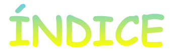
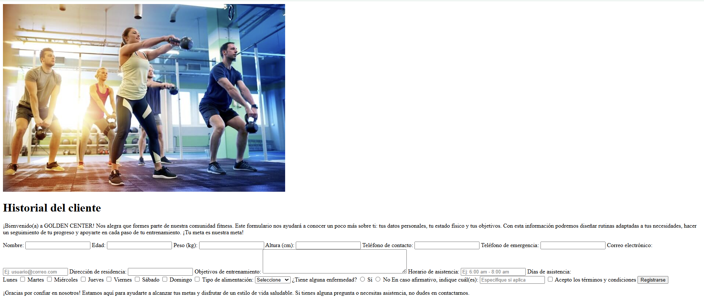
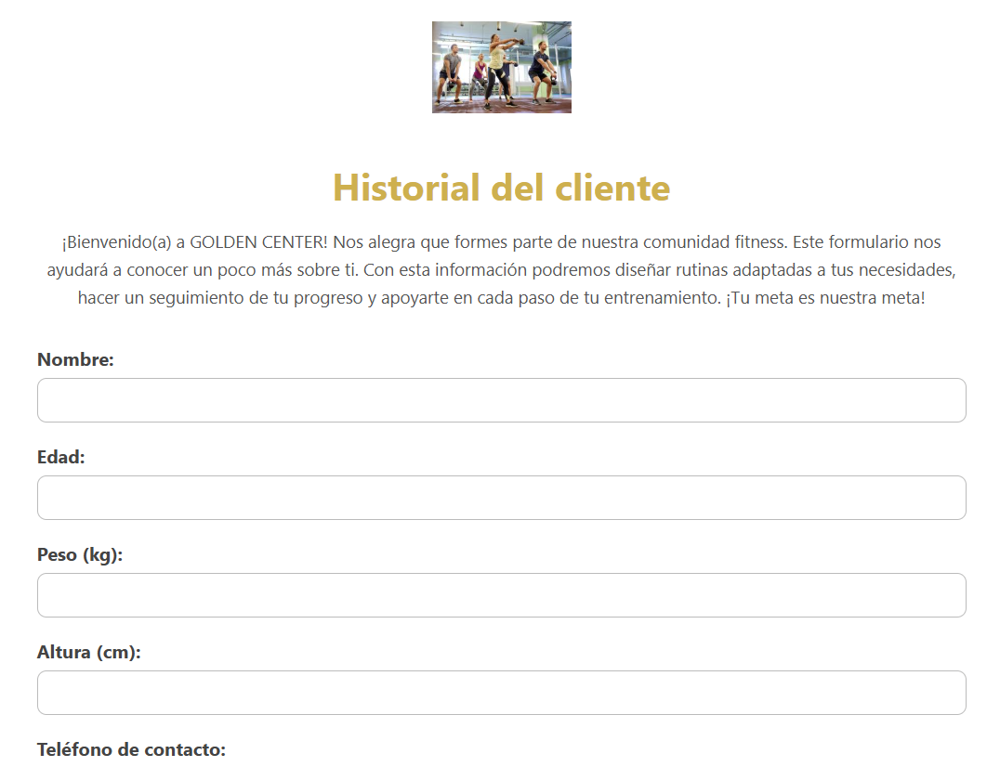

# 

Este repositorio contiene el desarrollo de un formulario para un gimnasio, el cual irá mostrando su evolución desde las primeras etapas hasta la versión final.
El objetivo de este proyecto es practicar el uso de HTML, CSS y JavaScript para la creación de formularios web, aplicando conceptos vistos en clase y mejorando poco a poco su diseño y funcionalidad.
Aquí se podrán encontrar los diferentes avances que reflejan el proceso de aprendizaje y construcción del formulario hasta su culminación.

---

## 

- [Inicios del formulario](#inicios-del-formulario)
- [Comienzan los ajustes](#comienzan-los-ajustes)
- [Recomendaciones](#recomendaciones)  
- [Conclusiones](#conclusiones)
- [Desarrolladora](#desarrolladora)

---

## 

Para iniciar el desarrollo del software, el primer paso fue elaborar un formulario base

  

[🔼 Volver al índice](#indice)

---

## 

En la primera versión del formulario (imagen 1) se puede ver la estructura básica, pero sin un diseño visual atractivo ni buena organización de los campos. Después de realizar los primeros ajustes (imagen 2), el formulario ya muestra un estilo más limpio y ordenado, con mejor distribución de los elementos y una apariencia más profesional. Aun así, el trabajo no está terminado, pues se seguirán haciendo mejoras para optimizar tanto la parte estética como la funcionalidad del formulario.

[🔼 Volver al índice](#indice)

---

## 

<!-- Aquí puedes agregar el contenido de tus recomendaciones -->

[🔼 Volver al índice](#indice)

---

## 

<!-- Aquí puedes agregar el contenido de tus conclusiones -->

[🔼 Volver al índice](#indice)

---

## 

Este proyecto fue desarrollado por Johana Jazmín Saavedra, estudiante de cuarto semestre en Técnica profesional en programación de aplicaciones de software de la Fundación Universitaria Compensar. Con una participación activa en la creación y desarrollo del proyecto.

  
   
  <strong>Johana Jazmín Saavedra</strong>

[🔼 Volver al índice](#indice)

---
